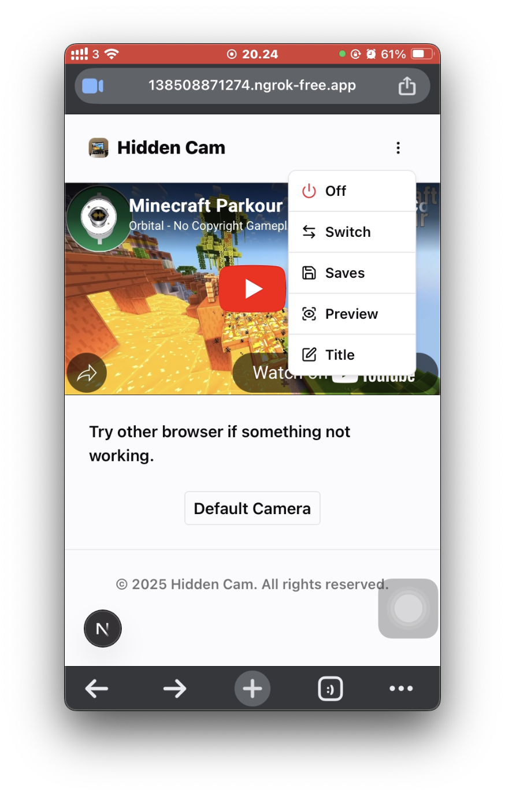

# Hidden Cam Web

Record and save video evidence secretly through your browser. — designed to debunk scammers. 100% Stored Locally in your browser.

### Features
- Change Title App
- Turn on/off small preview
- Recording Saved in local browser
- Switch camera
- No recording send to server
- No data collected (it's open source, you can check the code)

### 🕵️ How it works
- ✅ **Grant camera access**
- ▶️ **Play YouTube video** → camera starts recording in the background
- ⏸️ **Pause YouTube video** → recording stops and is auto-saved
- 📁 All recordings are stored locally (in-browser) in **.webm format**

### 📱 iPhone Notes
- Backgrounding the browser will disable camera (audio may still record)
- WebM format not natively supported — convert to .mp4 with external tools
- Saving doesn't work on Brave browser due to storage restrictions

### 💻 Desktop Notes (tested mac)
- Best performance on Chromium-based browsers (e.g., Edge, Chrome)
- Safari does not support WebM playback

Use responsibly. This tool exists to protect, not to violate. It is your duty to comply with local laws when recording.